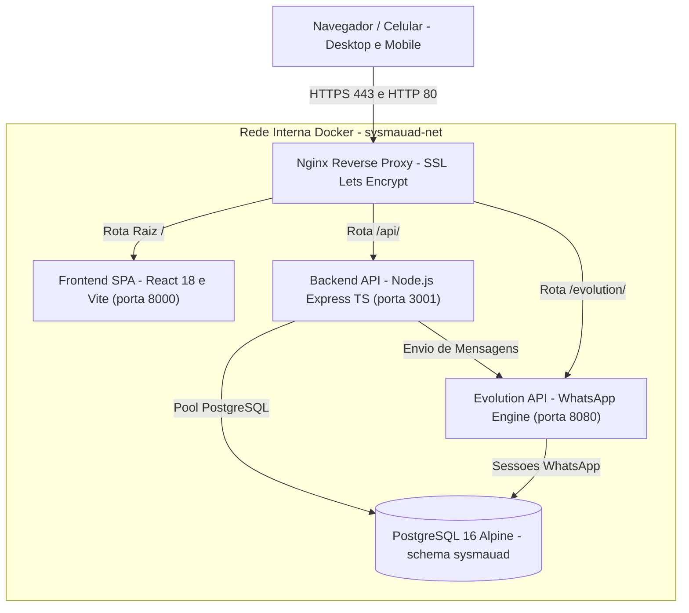

# SysMauad • Sistema Integrado de Gestão para Lavanderia Industrial

[](https://www.docker.com/)
[](https://react.dev/)
[](https://www.typescriptlang.org/)
[](https://nodejs.org/)
[](https://www.postgresql.org/)
[](https://tailwindcss.com/)
[](https://www.iana.org/time-zones)

O **SysMauad** é um ERP completo e especializado para gestão de lavanderias industriais têxteis e beneficiamento de confecções (jeanswear e malharia). Projetado sob medida para atender às necessidades do polo têxtil, o sistema integra pesagem industrial de lotes, cálculo automático de insumos químicos por percentual de dosagem, controle de passadoria no chão de fábrica via QR Code, portal de autoatendimento para confecções clientes, faturamento consolidado por período e automação de mensagens via WhatsApp.

---

## 🏗️ Arquitetura do Sistema

Toda a infraestrutura do SysMauad é orquestrada em contêineres Docker, garantindo portabilidade, isolamento de recursos e estabilidade em produção:



### Serviços e Contêineres

| Contêiner | Imagem / Base | Porta Externa | Descrição |
|-----------|---------------|---------------|-----------|
| `sysmauad-nginx` | `nginx:alpine` | `80`, `443` | Reverse proxy com terminação SSL, roteamento das APIs e compactação |
| `sysmauad-frontend` | `node:20` -> `nginx:alpine` | `8000` (interno) | Single Page Application compilada com React, Vite e TailwindCSS |
| `sysmauad-backend` | `node:20-alpine` | `3001` | API REST em TypeScript com pool de conexões PostgreSQL e regras de negócio |
| `sysmauad-postgres` | `postgres:16-alpine` | `5432` | Banco relacional com persistência em volume `postgres_data` |
| `sysmauad-evolution` | `evoapicloud/evolution-api:latest` | `8080` | Microsserviço de WhatsApp para envio de notificações e relatórios |

> **Nota Crítica de Fuso Horário:** Todos os 5 contêineres e o PostgreSQL operam estritamente configurados com `TZ=America/Sao_Paulo` e `PGTZ=America/Sao_Paulo`, montando `/etc/localtime` e `/etc/timezone` do host. Isso garante total sincronia entre a data do banco, emissão de faturas e filtros diários de relatórios.

---

## 📦 Módulos e Funcionalidades

### 1. Painel / Dashboard Operacional
- Indicadores em tempo real: peças em processamento, faturamento previsto, ordens recebidas e concluídas no dia.
- Alertas visuais imediatos de produtos químicos abaixo do estoque de segurança.
- Acesso rápido a novas ordens de serviço e leitura de QR Code.

### 2. Pedidos / Ordens de Serviço (OS) com Pesagem Industrial
- **Cálculo por Pesagem**: Abertura de lote informando peso total na balança (kg), tara de caixas e peso de referência unitário de uma peça (g) para estimar a quantidade com precisão.
- **Vínculo com Catálogo**: Associação de modelos de peças (calças, shorts, jaquetas, croppeds) e tipos de lavagem.
- **Ficha Técnica e Receita de Lavado**: Impressão de ficha de entrada com código de barras/QR Code e folha com fases químicas para os operadores das máquinas de lavar.

### 3. Insumos Químicos & Dosagem Percentual
- Cadastro de insumos: desengomantes (`PVWET`), enzimas para estonagem (`PVZYME`), pó de estonagem mineral (`PVSTONE`), permanganato de potássio, metabissulfito, amaciantes concentrados (`PVSOFT`), etc.
- **Fórmula de Dosagem Industrial**: Produtos químicos calculados dinamicamente com base no percentual sobre o peso total do lote:
  $$\text{Dose Utilizada} = \text{Peso Total do Lote (kg)} \times \left(\frac{\% \text{ do Produto}}{100}\right)$$
- Registro de compras e entradas com fornecedores, NF e custo unitário para cálculo de markup.

### 4. Tabela de Peças & Catálogo de Lavagem
- Pré-configuração de tipos de vestuário por categoria (Adulto, Infantil, Juvenil).
- Tabela de preços unitários associada ao tipo de processo (Hiper Destroyed, Estonado no Pó, Amaciado, Alvejado).

### 5. Gestão de Clientes & Portal do Cliente
- Cadastro otimizado para confecções e marcas de moda.
- **Portal do Cliente (`#/client-portal`)**: Interface pública onde o cliente acessa via número de telefone e senha própria para:
  - Consultar suas Ordens de Serviço ativas e histórico finalizado.
  - Visualizar quantidades de peças conferidas e status em tempo real.
  - Baixar faturas e demonstrativos financeiros consolidados.
  - Proteção de sessão persistente sem conflito de cache ao realizar logout.

### 6. Financeiro & Caixa Consolidado
- Gestão de contas a receber com visão unificada.
- **Faturamento por Período**: Seleção de intervalos de datas e clientes específicos.
- **Baixa Unificada ("Dar baixa em todos")**: Permite liquidar em um único clique todas as OS selecionadas de um período para o cliente, gerando um demonstrativo financeiro consolidado.
- Resumo com valor bruto, descontos concedidos e valor líquido recebido.

### 7. Relatórios da Passadoria & Produção
- Fechamento de produção por dia, semana e mês.
- Controle de rendimento individual por passador para apuração de comissões e metas.
- Exportação e impressão de relatórios consolidados em formato limpo.

### 8. Terminal Passador Mobile
- Interface simplificada otimizada para smartphones e tablets no setor de passadoria.
- Leitor de QR Code integrado para ler a etiqueta da OS diretamente da câmera do aparelho e registrar as peças passadas em segundos.

### 9. Controle de Acessos, Usuários e Auditoria
- Perfis de usuário com permissões granulares por abas (`admin`, `operador`, `passador`).
- Registro detalhado de logs em `sysmauad.audit_logs` para rastreamento de ações críticas (exclusões, alterações de preços, baixas financeiras e logins).

### 10. Automação WhatsApp (Evolution API)
- Envio automatizado de mensagens de confirmação ao cliente na entrada da OS.
- Notificação de pedido pronto para retirada/entrega.
- Envio de relatórios gerenciais diários automáticos para os gestores da lavanderia.

---

## 🖨️ Padrão de Impressão Global (Sem Marcas de Navegador)

Todos os relatórios e fichas de serviço do SysMauad foram desenvolvidos com regras de impressão padronizadas:

1. **Supressão Automática de Cabeçalhos e Rodapés**:
   - O arquivo `frontend/src/index.css` define `@page { margin: 0; size: auto; }`. Isso força os navegadores (Chrome, Edge, Firefox, Safari) a **ocultar automaticamente** a URL, numeração de página (`1/1`) e o carimbo de data/hora nos cantos do papel.
2. **Margens Físicas Seguras**:
   - Os contêineres de impressão usam as classes `.print-sheet` ou `.print-only` com `padding: 12mm 15mm !important`, garantindo que o texto nunca seja cortado pelas margens da impressora física.
3. **Cabeçalhos Concisos e Oficiais**:
   - Apresenta apenas `MAUAD LAVANDERIA`, a identificação do documento (`DEMONSTRATIVO CONSOLIDADO`, `FATURA DE SERVIÇOS` ou `ORDEM DE SERVIÇO`) e o período/emissão lateral.

---

## 🚀 Como Executar em Produção

### Pré-requisitos
- Docker Engine 24+ e Docker Compose V2
- Certificado SSL gerado para o domínio (ex: via Certbot em `/etc/letsencrypt`)

### 1. Clonar o Repositório
```bash
git clone https://github.com/JeffByller/sysmauad.git /opt/sysmauad
cd /opt/sysmauad
```

### 2. Configurar Variáveis de Ambiente
Copie o arquivo de exemplo e edite as credenciais:
```bash
cp .env.example .env
nano .env
```

Conteúdo esperado do `.env`:
```env
POSTGRES_DB=sysmauad
POSTGRES_USER=sysmauad_user
POSTGRES_PASSWORD=sua_senha_segura_do_postgres
EVOLUTION_API_KEY=sua_chave_secreta_da_evolution
PORT=3001
NODE_ENV=production
```

### 3. Iniciar Todos os Serviços
```bash
docker compose up -d --build
```

O sistema estará acessível em:
- **Aplicação Principal**: `https://sysmauad.jeffgsan.com.br`
- **Portal do Cliente**: `https://sysmauad.jeffgsan.com.br/#/client-portal`
- **API Backend**: `https://sysmauad.jeffgsan.com.br/api/`
- **WhatsApp Evolution Gateway**: `https://sysmauad.jeffgsan.com.br/evolution/`

---

## 🛠️ Comandos Operacionais Úteis

### Gerenciamento de Contêineres
```bash
# Ver status de saúde de todos os contêineres
docker ps

# Ver logs do backend em tempo real
docker logs -f --tail 100 sysmauad-backend

# Ver logs do WhatsApp (Evolution API)
docker logs -f --tail 100 sysmauad-evolution

# Recompilar apenas o frontend após alterações
docker compose build frontend && docker compose up -d frontend

# Recompilar apenas o backend após alterações
docker compose build backend && docker compose up -d backend
```

### Verificação de Horário do Sistema
```bash
# Todos devem retornar o mesmo horário em UTC-3 (Horário de Brasília)
docker exec sysmauad-postgres date
docker exec sysmauad-backend date
date
```

### Banco de Dados & Backups
```bash
# Acessar terminal interativo do PostgreSQL
docker exec -it sysmauad-postgres psql -U sysmauad_user -d sysmauad

# Gerar backup manual imediato
docker exec sysmauad-postgres pg_dump -U sysmauad_user sysmauad > /opt/sysmauad/data/backup_manual_$(date +%Y%m%d_%H%M%S).sql

# Restaurar backup
cat /caminho/do/backup.sql | docker exec -i sysmauad-postgres psql -U sysmauad_user -d sysmauad
```

---

## 🤖 Antigravity Skills & Regras de IA

Este repositório possui regras e runbooks especializados configurados em [`.agents/`](file:///opt/sysmauad/.agents/) para assistência via **Google Antigravity**:

- **Regras Gerais**: [`AGENTS.md`](file:///opt/sysmauad/AGENTS.md)
  - [`01-development.md`](file:///opt/sysmauad/.agents/rules/01-development.md): Padrões de código React, TypeScript e Express.
  - [`02-infrastructure.md`](file:///opt/sysmauad/.agents/rules/02-infrastructure.md): Padrões de Docker, Nginx e timezone `America/Sao_Paulo`.
  - [`03-printing.md`](file:///opt/sysmauad/.agents/rules/03-printing.md): Diretrizes para layouts de impressão e supressão de cabeçalhos do navegador.
- **Skills On-Demand**:
  - `sysmauad-dev`: Fluxo de desenvolvimento, compilação de código e hot-reload.
  - `sysmauad-infra`: Diagnóstico de contêineres, gestão de memória e rotinas de backup.
  - `sysmauad-docs`: Manutenção contínua de documentação e mapeamento de processos da lavanderia.
  - `sysmauad-print`: Criação e adaptação de templates térmicos e folhas A4 de serviço.

---

## 📄 Licença

Propriedade de **Mauad Lavanderia Industrial**. Todos os direitos reservados.
